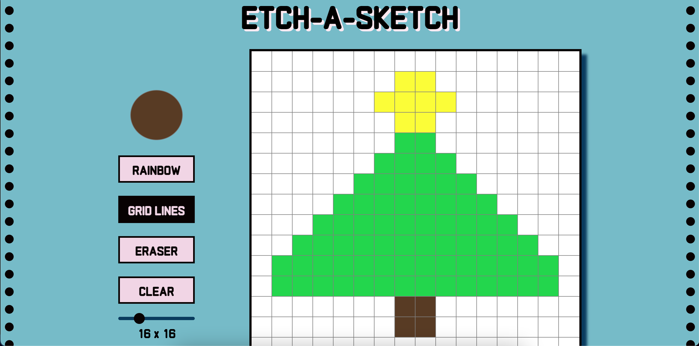

# odin-etch-a-sketch

This is a project from The Odin Project. I will be creating a mixture of a sketchpad and an Etch-A-Sketch. The user is able to fill in the sketchpad by either clicking the mouse down, or dragging the mouse over the sketchpad.

Customization includes:
- Selecting a color
- Toggling grid lines
- Toggling an eraser
- Clearing the board
- Adjusting the grid size

Preview of the project:

